# eHealth

The Idea Of “eHealth – A Complete Health Care” Website Using Mern Stack Development.

## Background and Motivation

In the event of a pandemic, everyone must rely on the internet. In Online People Don’t Always Get Their Desired Health Related Information Because There Are Very Few Health Related Website In Our Country. So We Decided To Work On Such An Idea Where We Can Utilize One Of The Important Sector In Bangladesh.
So That People Can Easily Get Their Desired Information During An Emergency Situation Or Pandemic. eHealth Is Very Essential For Everyone. eHealth Is The
Electronic Management Of Health Information To Deliver Safer, More Efficient ,And Better Quality Healthcare. eHealth Benefits Patient Care By Providing New
Ways Of Managing Health Information And The Deliver Them Online. A Personal Digital Healthcare Environment Gives People More Insight Into Their Health.

## Objective 
We Want To Make An eHealth Platform With Better User Interface And More
Beneficial.
- Create A User Friendly System, So The Healthcare System Will Be Equitable.
- Create A Valuable Information System Enhancing The Quality Of Life For
Everyone.
- Full Online Support For A Medical Environment System.
- Following Emergency Protocol And Buying Medicine Online.
- Easily Get Doctor List And Information From Anywhere.
- Ambulance And Blood Managing Within A Few Minutes.
- Enable Fast And Remote Healthcare Monitoring.

## Project Features:
- User Registration and Sign In Option including account verification and password reset from gmail.
- Medicine Info & Add Medicine to Cart then buy.
- Applying promo code to get discount.
- Shopping Address and Payment Method.
- Pay Using AamarPay(BD) And Paypal(Global)
- Post Review About That Medicine. 
- Doctor Info & Get Doctor Appointment.
- Blood Info & Smart Search and Filter Option For Donors.
- Request For Blood In Emergency Situation.
- Chat with administrator regarding doctors and more.
  
**General Admin (Staff) Controls** 
- Can See People Order.
- Can Add Anything.
- Can Update Anything.
- Can Delete Anything.
- Can See All History.
- Can Approve, Deliver Orders, Appointments and Requests.
- Category Pages Optimized for SEO.
- Responsive Layout.

## User Interface :

  <b>Title</b> 
    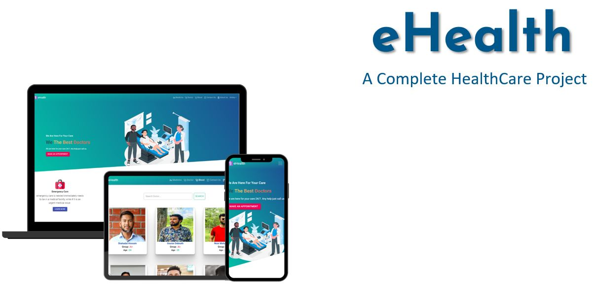
   <b> Registration / User Login / Forget Password</b> 
    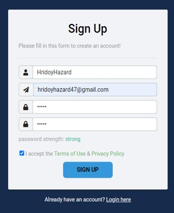
    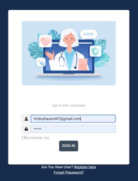
    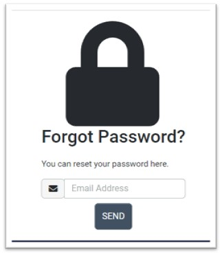
     <b> Medicine Info Page</b> 
    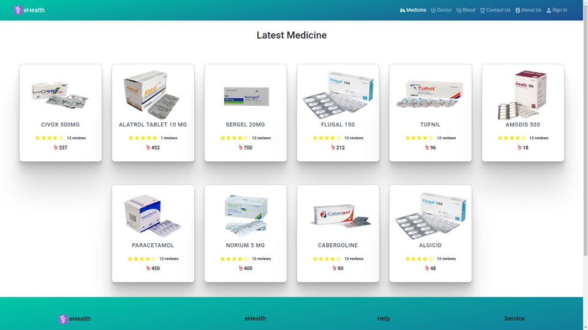
    <b> Medicine Page Details</b> 
    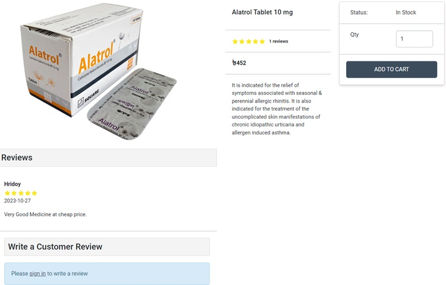
     <b> Purchase Process</b> 
    
    
     <b> Select Payment</b> 
    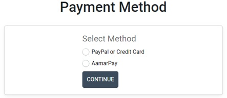 
    <b> AamarPay</b> 
    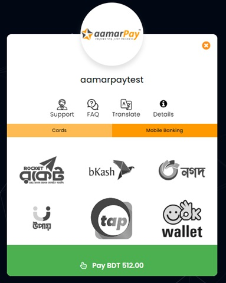 
    <b> Paypal</b> 
    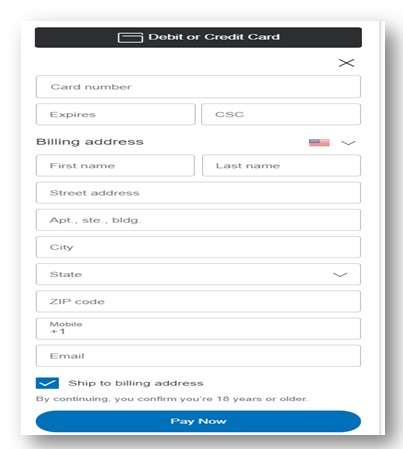 
    <b> Doctor Info</b> 
    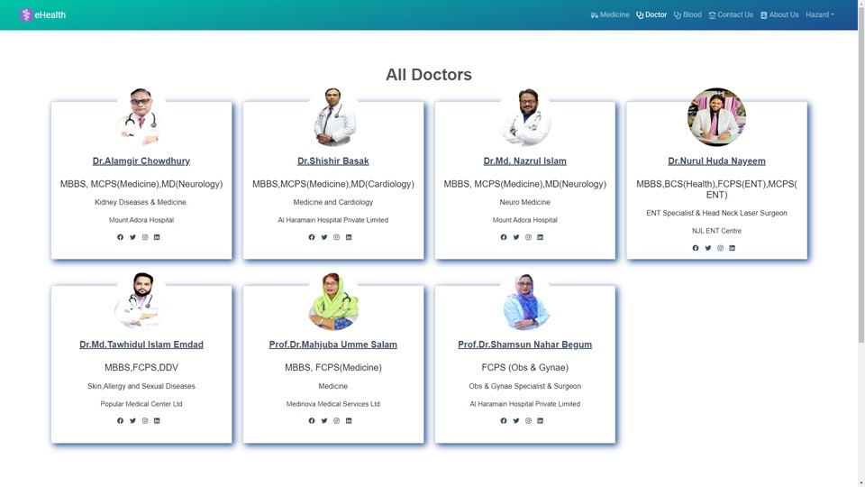
    <b> Doctor Details</b> 
    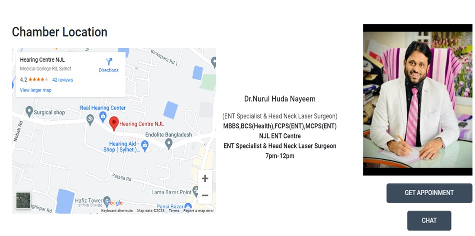
    <b> Appointment Process</b> 
    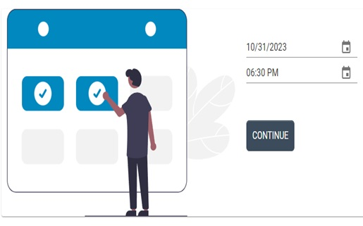
    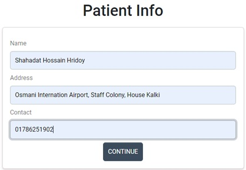
     <b> Appointment Confirm</b> 
    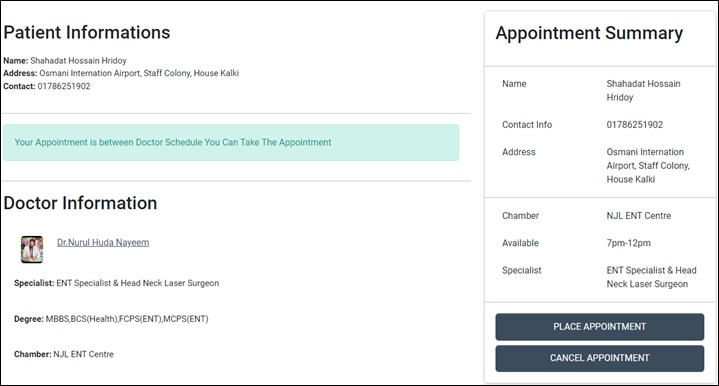
     <b> Blood Donors</b> 
    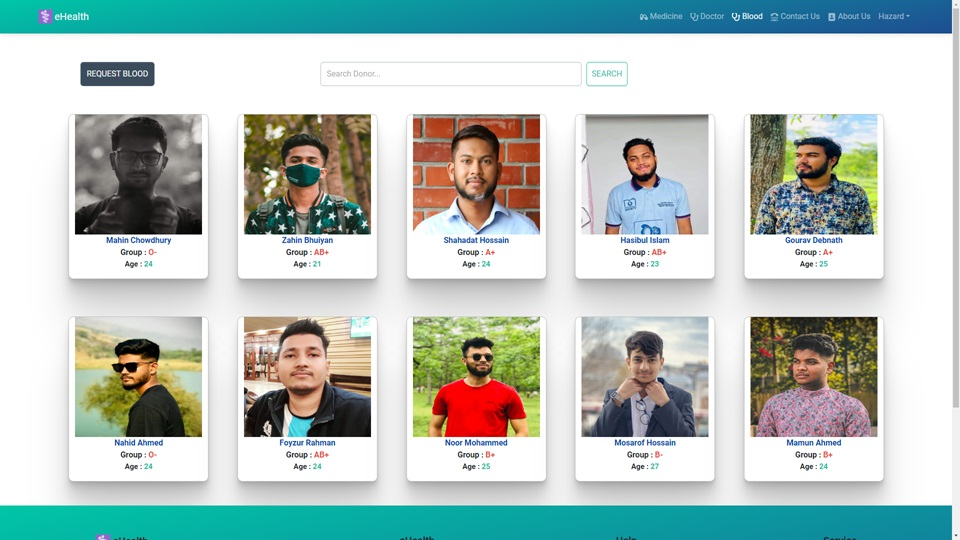
     <b> Filter Donor</b> 
    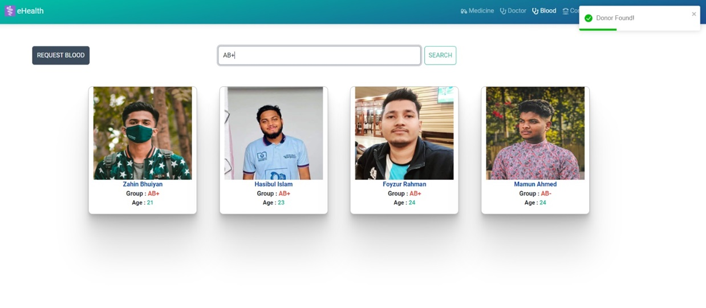
     <b> Request Blood</b> 
    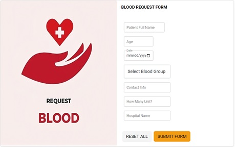
    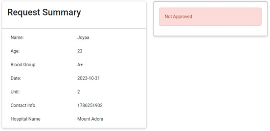 
    <b> Approving Request From Admin Panel</b> 
    
    <b> User Profile </b> 
    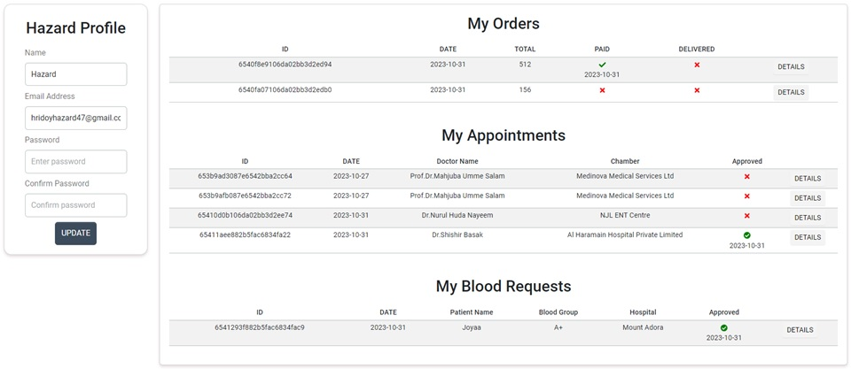
    <b> Admin Profile</b> 
    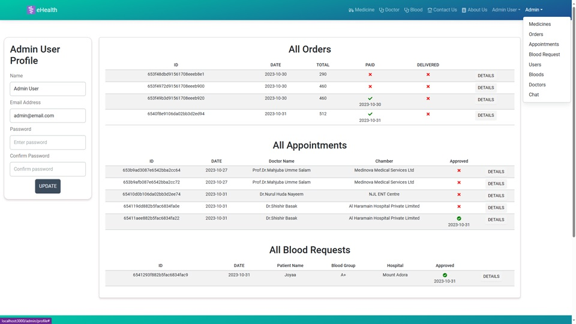
    <b> Medicine Panel</b> 
    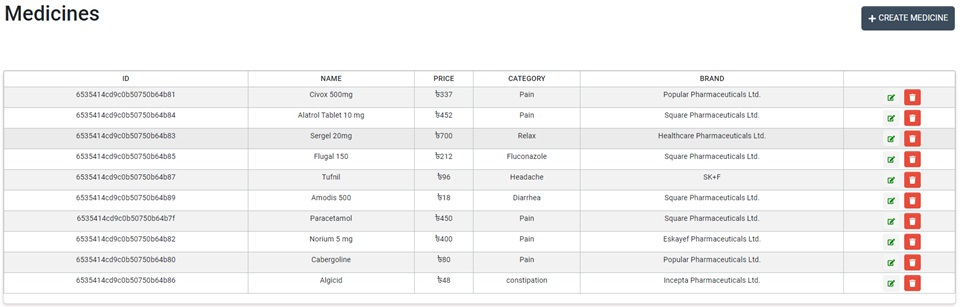
    <b> Create, Update and Delete Medicines</b> 
    
    <b> Doctor Panel</b> 
    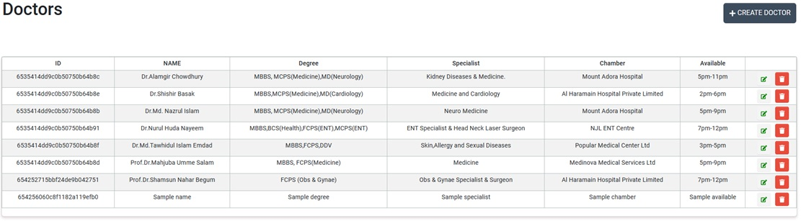
    <b> Create, Update and Delete Doctors</b> 
    
    <b> Donor Panel</b> 
    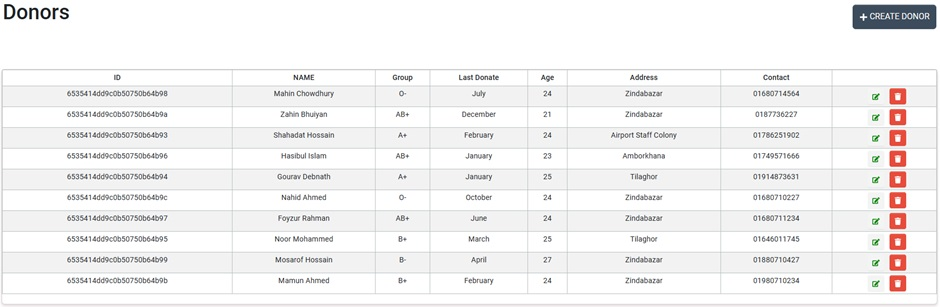
    <b> Create, Update and Delete Donors</b> 
    
    <b> Users Panel</b> 
    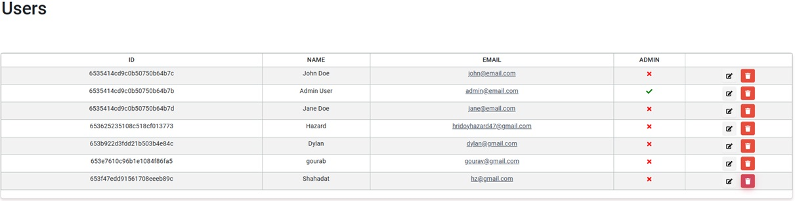
    <b> Update and Delete Users</b> 
    
    <b> Appointments,Orders and Requests</b> 
    

